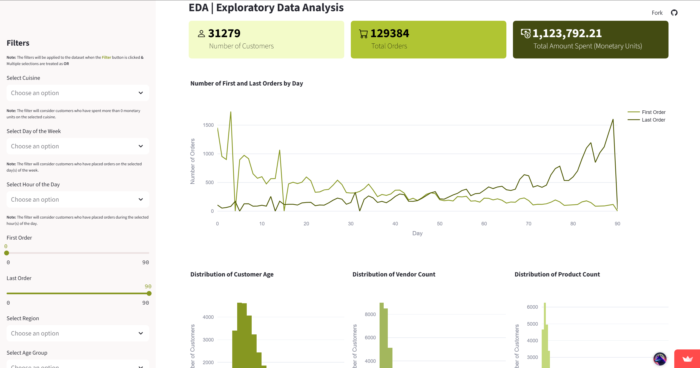

<p align="center">
   <a href="https://dm-project-abcdeats-group37.streamlit.app/">
        
    </a>
</p>

# 🍕 ABCDEats Inc. - Data Mining Project Dashboard 🚀 ([Live App](https://dm-project-abcdeats-group37.streamlit.app/))

## 📝 Description

This repository contains the source code for the **interactive Streamlit web application** that serves as the deployment component for our main Data Mining project. This dashboard is designed to bring the project's findings to life, providing an intuitive interface to explore customer data and interact with the final segmentation model for **ABCDEats Inc**.

<p align="center">
    <!-- Project Links -->
    <a href="https://github.com/Silvestre17/DM_FoodDeliveryClustering_MasterProject"></a>
    <a href="https://dm-project-abcdeats-group37.streamlit.app/"></a>
    <a href="https://github.com/Silvestre17/DM_Dashboard_Group37"></a>
</p>

<br>

## 🔗 Relation to Main Project

This dashboard visualizes the Exploratory Data Analysis (EDA) and Customer Segmentation findings from our comprehensive Data Mining project on ABCDEats Inc. The main project, including data preprocessing, clustering analysis, and detailed reports, can be found in the primary repository:

➡️ **Main Project Repository:** [Silvestre17/DM_FoodDeliveryClustering_MasterProject](https://github.com/Silvestre17/DM_FoodDeliveryClustering_MasterProject) ⬅️

<br>

## 🎓 Project Context

This dashboard was developed as the final deployment phase for the **Data Mining** course in the **[Master's in Data Science and Advanced Analytics](https://www.novaims.unl.pt/en/education/programs/postgraduate-programs-and-master-degree-programs/master-degree-program-in-data-science-and-advanced-analytics-with-a-specialization-in-data-science/)** program at **NOVA IMS** (2024/2025).

## 🛠️ Technology Stack

This application was built entirely in Python, using a modern stack for creating interactive, data-driven web apps.

#### Core Stack
<p align="center">
    <a href="https://www.python.org/"></a>
    <a href="https://pandas.pydata.org/"></a>
    <a href="https://numpy.org/"></a>
</p>

#### Visualization & Web App
<p align="center">
    <a href="https://www.streamlit.io/"></a>
    <a href="https://www.plotly.com/"></a>
    <a href="https://www.matplotlib.org/"></a>
    <a href="https://www.seaborn.pydata.org/"></a>
</p>

---

## 📍 Dashboard Features

This application is designed to empower stakeholders at ABCDEats Inc. with self-service analytics capabilities.

*   **📊 Interactive EDA:** Dynamic charts and graphs (time series, histograms, sunburst charts) that visualize the key insights from our initial Exploratory Data Analysis.
*   **🧑‍🤝‍🧑 Customer Segment Explorer:** A dedicated section to deep-dive into the characteristics of the final 5 customer segments, visualizing their profiles and compositions.
*   **🎛️ Dynamic Filtering:** Users can apply multiple filters—such as cuisine preference, order time, region, or promo usage—to the dataset and see their impact on all visualizations in real-time.


## 🖥️ Live Application & Showcase

Explore the interactive dashboard live:

➡️ **[dm-project-abcdeats-group37.streamlit.app](https://dm-project-abcdeats-group37.streamlit.app/)** ⬅️

<p align="center">
   <a href="https://dm-project-abcdeats-group37.streamlit.app/">
      
   </a>
</p>

## 🚀 Local Setup & Deployment

To run this dashboard on your local machine, please follow these steps:

1.  **Clone the Repository:**
    ```bash
    git clone https://github.com/Silvestre17/DM_Dashboard_Group37.git
    cd DM_Dashboard_Group37
    ```

2.  **Install Dependencies:**
    It is highly recommended to use a virtual environment.
    ```bash
    # Create and activate a virtual environment
    python -m venv venv
    source venv/bin/activate  # On macOS/Linux
    # .\venv\Scripts\activate  # On Windows

    # Install requirements
    pip install -r requirements.txt
    ```

3.  **Run the Streamlit Application:**
    ```bash
    streamlit run dmproject_group37_streamlit.py
    ```

4.  **Access the Dashboard:**
    Open your web browser and navigate to the local URL provided in the terminal (usually `http://localhost:8501`). Enjoy exploring the data! 🎉

---

## 👥 Team Members (Group 37)

*   **André Silvestre** (20240502)
*   **Filipa Pereira** (20240509)
*   **Umeima Mahomed** (20240543)
